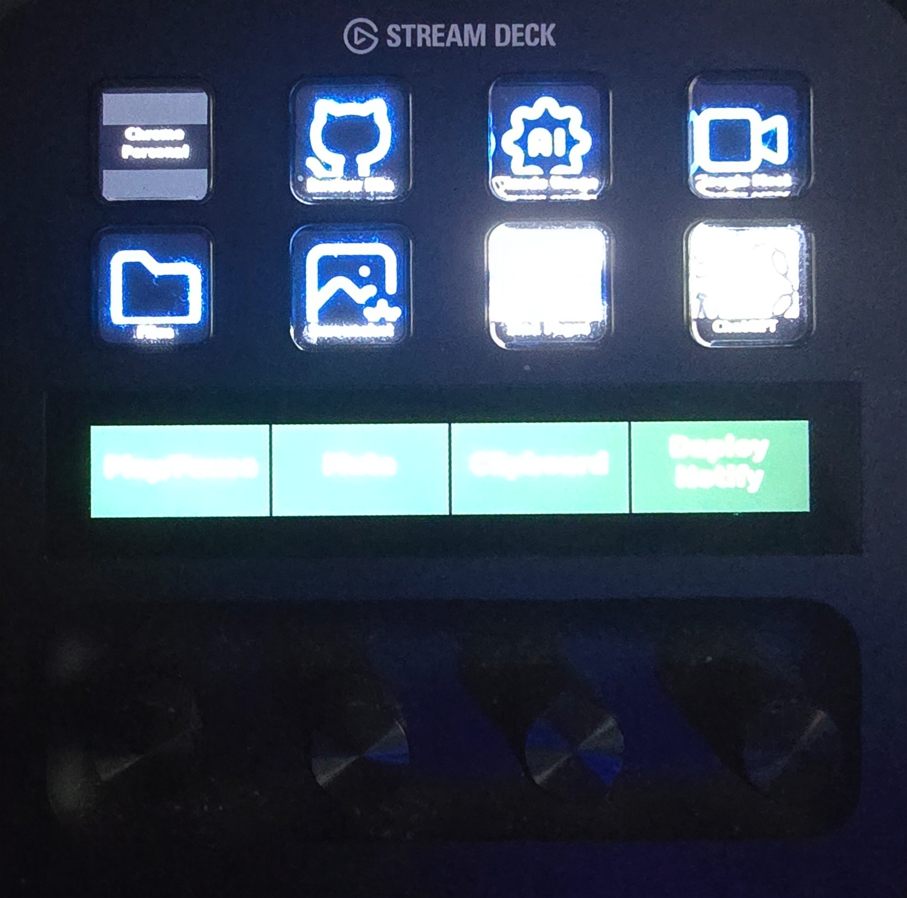
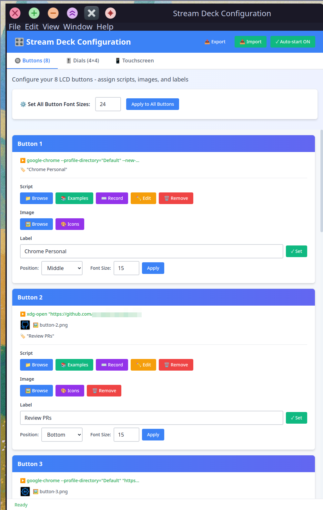
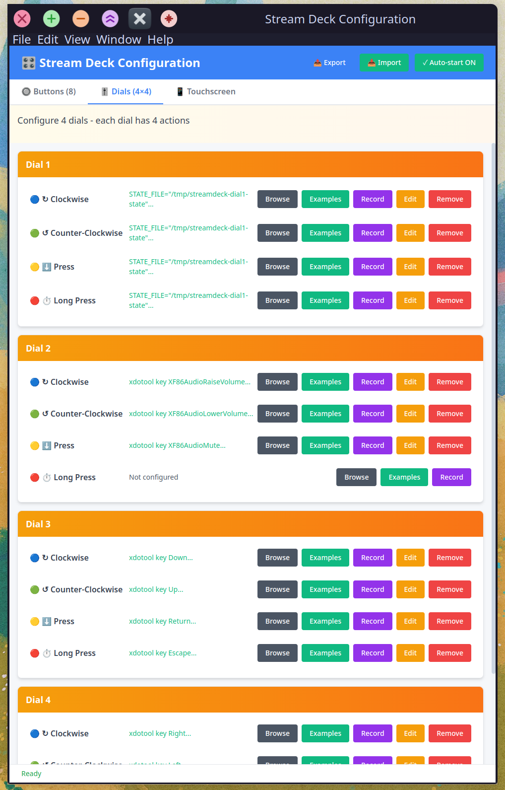
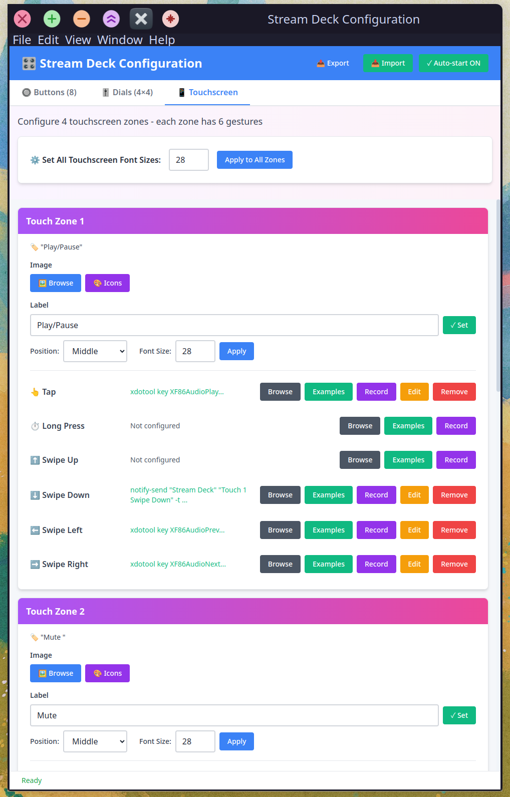
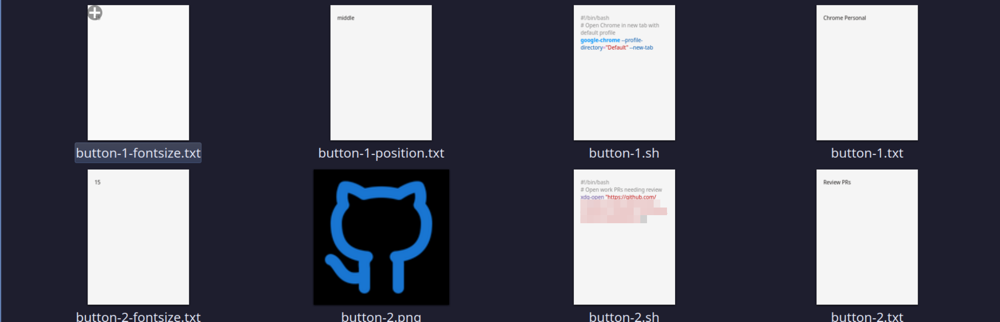

# 🎛️ Stream Deck Plus - Complete Action System

> Transform your Elgato Stream Deck Plus into a powerful automation tool with 50 customizable actions, beautiful UI configuration, and macro recording capabilities.

[](https://opensource.org/licenses/MIT)
[](https://www.python.org/downloads/)

## ✨ Features

- **50 Customizable Actions** - 8 LCD buttons, 16 dial actions (4 dials × 4 gestures), 24 touchscreen gestures, 2 long swipes
- **Beautiful GUI Configurator** - Point-and-click interface to assign scripts, images, and labels
- **128 Ready-to-Use Examples** - 50 general actions + 78 developer-focused scripts
- **Macro Recorder** - Record keyboard shortcuts and complex key sequences
- **Custom Images & Labels** - Personalize every button and touchscreen zone
- **Hot-Reload Support** - Changes take effect immediately without restarting
- **Complete Logging** - Track every action and debug easily
- **Zero Configuration** - No JSON, no complex setup - just bash scripts!


*Your Stream Deck Plus with fully customized buttons, dials, and touchscreen zones*

## 🚀 Quick Start

### Installation

```bash
# Clone the repository
git clone https://github.com/YOUR_USERNAME/streamdeck-actions.git
cd streamdeck-actions

# Install Python dependencies
pip3 install --user streamdeck

# Make scripts executable
chmod +x start configure create-action streamdeck-daemon.py

# Start the daemon
./start
```

### Launch Configuration UI

```bash
./configure
```

The GUI lets you:
- Browse and select from 128 example scripts
- Assign custom images to buttons and touchscreen zones
- Add text labels
- Record keyboard macros
- See what's currently configured
- Enable/disable auto-start on login with one click
- Export/import your entire configuration

#### Configure Your Buttons

*Easily assign scripts, images, and labels to your 8 LCD buttons*

#### Configure Your Dials

*Set up clockwise, counter-clockwise, press, and long-press actions for each dial*

#### Configure Your Touchscreen

*Customize tap, long press, and swipe gestures for all 4 touchscreen zones*

## 📋 Supported Gestures

### LCD Buttons (8)
- Press → Execute script

### Rotary Dials (4 dials × 4 actions = 16)
- Rotate clockwise
- Rotate counter-clockwise
- Press (quick tap)
- Long press (hold 0.5s+)

### Touchscreen (4 zones × 6 gestures = 24)
- Tap
- Long press
- Swipe up/down/left/right

### Screen-Wide Gestures (2)
- Long swipe left (across entire screen)
- Long swipe right (across entire screen)

**Total: 50 customizable actions!**

## 📚 Example Scripts Included

### General Actions (50 scripts)
- **Volume & Media Control** (8) - Volume up/down/mute, play/pause, next/previous track
- **Window Management** (9) - Maximize, minimize, tile, switch workspaces
- **Screenshots** (4) - Full screen, area, window capture
- **Flameshot Screenshots** (8) - GUI, clipboard, delay, pin, custom save
- **System Actions** (5) - Lock, logout, suspend, brightness
- **Applications** (3) - Browser, terminal, file manager
- **Keyboard Automation** (13) - Common shortcuts and text snippets

### Developer Actions (78 scripts)
- **Navigation** (12) - Arrow keys, page up/down, home/end
- **Code Editing** (14) - Duplicate line, delete line, format, comment
- **Code Navigation** (8) - Go to definition, find references, rename
- **Search & Replace** (4) - Find, replace, multi-cursor
- **IDE Interface** (7) - Terminal, sidebar, command palette
- **Debugging** (9) - Start, stop, step over/into, breakpoints
- **Git Commands** (7) - Status, add, commit, push, pull
- **NPM/Docker/Python** (9) - Common development commands
- **Build Tools** (2) - Make, build commands
- **Terminal** (3) - Clear, navigate, list files

## 🎨 Customization

### File Structure

```
streamdeck-actions/
├── buttons/              # 8 button scripts + images + labels
│   ├── button-1.sh       # Script to execute
│   ├── button-1.png      # Custom image (120×120)
│   └── button-1.txt      # Label text
├── dials/                # 4 dials × 4 actions each
│   ├── dial-1-cw.sh      # Rotate clockwise
│   ├── dial-1-ccw.sh     # Rotate counter-clockwise
│   ├── dial-1-press.sh   # Press
│   └── dial-1-longpress.sh
├── touchscreen/          # 4 zones × 6 gestures + 2 long swipes
│   ├── touch-1.sh        # Tap
│   ├── touch-1-longpress.sh
│   ├── touch-1-swipe-up.sh
│   ├── touch-1.png       # Zone image (200×100)
│   ├── touch-1.txt       # Zone label
│   ├── longswipe-left.sh
│   └── longswipe-right.sh
└── examples/             # 120 ready-to-use scripts
    ├── volume-up.sh
    ├── media-play-pause.sh
    └── dev-actions/      # 78 developer scripts
        ├── arrow-up.sh
        ├── git-status.sh
        └── ...
```

### Creating Custom Actions

**Using the GUI (Recommended):**
1. Run `./configure`
2. Click "Browse" or "Examples" for the action you want
3. Select a script
4. Optionally add an image and label
5. Done! Changes take effect immediately


*Browse through example scripts or create your own custom actions*

**Manual Method:**
1. Create a bash script in the appropriate directory
2. Make it executable: `chmod +x your-script.sh`
3. Optionally add images (.png/.jpg) and labels (.txt)
4. The daemon automatically detects changes

**Example Script:**
```bash
#!/bin/bash
# Launch VS Code
code
```

## 🎯 Use Cases

### For Developers
- Quick access to Git commands
- IDE shortcuts at your fingertips
- Build and deploy with one button
- Debug controls on dials
- Terminal commands on touchscreen

### For Creators
- Media playback control
- Scene switching
- Audio mixing
- Screenshot tools
- Application launching

### For Power Users
- Window management
- Virtual desktop switching
- Volume and brightness control
- Custom keyboard macros
- System commands

## 🔧 Advanced Features

### One-Click Auto-Start
Enable or disable auto-start on login with a single button click in the configuration UI! The system uses both desktop autostart entries and systemd services for maximum compatibility.

To customize for your system, edit:
- `setup-autostart.sh` - Enable auto-start
- `remove-autostart.sh` - Disable auto-start

### 🎬 Intelligent Macro System - The Game Changer

**Record. Replay. Step Through. Undo. All with a single dial.**

The macro system transforms Dial 1 into a powerful macro recorder that goes beyond simple playback:

#### What Makes It Special

✨ **Full Keyboard Capture**
- Every keystroke recorded: letters, numbers, symbols, arrows, modifiers
- Key combinations captured perfectly: Ctrl+C, Shift+Arrow selections, multi-key shortcuts
- Navigation keys: Home, End, Page Up/Down, arrows - everything works

🎯 **Intelligent Reverse Playback**
Unlike traditional macro tools that just use Ctrl+Z, our system intelligently reverses each action:
- Characters → Backspace removes them
- Arrow keys → Opposite direction (Left becomes Right)
- Home/End → Swap (Home becomes End)
- Modifier combos → Smart Ctrl+Z when needed

⚡ **Step-Through Control**
- **Turn right**: Execute next command in macro
- **Turn left**: Intelligently undo last command
- **Press**: Full macro playback
- **Long press**: Clear macro and start fresh
- **Auto-reset**: Position resets after 3 seconds of inactivity

🔔 **Real-Time Feedback**
- Visual notifications show current position (e.g., "Step 5/13")
- Single updating notification (no spam!)
- See exactly which key you're at in the sequence

#### How to Use

1. **Record a macro**:
   - Press Dial 1 → Recording starts
   - Type your workflow (shortcuts, text, navigation - anything!)
   - Press Dial 1 again → Recording stops

2. **Replay the macro**:
   - Press Dial 1 → Full playback
   - Turn right → Step forward one command at a time
   - Turn left → Step backward, intelligently undoing each action

3. **Clear and start over**:
   - Long press Dial 1 → Macro cleared

#### Real-World Example

Record this workflow once, replay it a thousand times:
```
Type: "this is my code"
Shift+Left (4 times) → highlight "code"
Ctrl+C → copy
End → jump to end of line
Ctrl+V → paste
Enter → new line
```

Then step through it command-by-command by turning the dial, or undo actions by turning backward. It's like having a time machine for your keyboard!

#### Technical Details

See the complete implementation in `examples/dev/`:
- `dial-1-press.sh` - Recording & playback engine
- `dial-1-cw.sh` - Step forward through macro
- `dial-1-ccw.sh` - Intelligent reverse playback
- `dial-1-longpress.sh` - Clear macro

Built with xinput for real-time keyboard monitoring and xdotool for precise playback.

### Icon Selector with Categories & Colors
Browse 4900+ free MIT-licensed icons from Tabler Icons with smart category filtering:
- **7 curated categories**: utils (~140), apps (~278), media (~239), dev (~214), system (~167), creative (~90), brand (~370)
- **Download only what you need** instead of all 4900+ icons
- **Outline or filled styles**: Choose your preferred icon style with clear naming
- **Predefined colors**: blue, red, green, orange, purple, pink, teal, and more
- **Custom hex colors**: `#FF5722` or any hex color
- **Colored icons on black backgrounds**: Icons appear in your chosen color, not white
- Clear naming: outline icons use `-o` suffix (`heart-red-o.png`), filled icons don't (`heart-red.png`)
- Search and preview in the UI

### Drag-and-Drop
Drag scripts and images directly onto buttons in the UI! Visual feedback shows where files will be placed.

### Hot-Reload
Changes to scripts, images, and labels are detected automatically. No need to restart the daemon!

### Export/Import
Backup and restore your entire configuration (scripts, images, labels) as a single .tar.gz file.

### Logging
Every action is logged with timestamps:
```bash
tail -f daemon.log
```

### Window Geometry Persistence
The configuration UI remembers its size and position between sessions.

## 📖 Documentation

- [Quick Start Guide](QUICK-START.txt) - Get up and running in 5 minutes
- [All Gestures Reference](ALL-GESTURES.md) - Complete gesture documentation
- [Complete System Overview](COMPLETE-SYSTEM.txt) - Detailed system information

## 🤝 Contributing

Contributions are warmly welcomed! This project thrives on community input and I'd love your help making it better. Here are some areas where contributions would be especially valuable:

### 🎯 High-Priority Contributions

**📜 New Example Scripts**
- Share your favorite automation scripts
- Add scripts for specific applications or workflows
- Expand the developer tools collection
- Create scripts for creative workflows (audio, video, graphics)

**🎨 Better Icon Usage**
- Improve icon selection and organization
- Create themed icon sets
- Better default icons for common actions
- Icon recommendations for specific use cases

**🔧 System Integration**
- Improve the auto-start mechanism
- Better desktop environment integration
- More robust daemon management
- System tray integration

**🐧 Multi-Distro Support**
- **Arch Linux support** - Package for AUR, test compatibility
- **Fedora/RHEL** - Adapt scripts for RPM-based systems
- **Other distros** - Ensure compatibility across the Linux ecosystem
- Testing and validation on different distributions

### 💡 Other Welcome Contributions

- Bug fixes and stability improvements
- Performance optimizations
- Documentation updates and clarifications
- UI/UX improvements for the configuration tool
- Feature suggestions and enhancements

### 📝 How to Contribute

1. Fork the repository
2. Create a feature branch (`git checkout -b feature/amazing-feature`)
3. Test your changes (especially if adding distro-specific code)
4. Commit your changes (`git commit -m 'Add amazing feature'`)
5. Push to the branch (`git push origin feature/amazing-feature`)
6. Open a Pull Request

**Note:** This project currently works well on Ubuntu/Linux but hasn't been extensively tested on other distributions. If you use Arch, Fedora, or another distro and can help test and adapt the scripts, your contribution would be invaluable!

## 💖 Support This Project

If you find this project useful, please consider supporting its development:

- ⭐ **Star this repository** on GitHub
- 🐛 **Report bugs** and suggest features via Issues
- 🔀 **Contribute** code or example scripts
- ☕ **Buy me a coffee** [Donation Link Here]
- 💬 **Share** with others who might find it useful

Your support helps keep this project maintained and improved!

## 📝 License

This project is licensed under the MIT License - see the [LICENSE](LICENSE) file for details.

## 🙏 Acknowledgments

- Built for the Elgato Stream Deck Plus
- Uses the excellent [python-elgato-streamdeck](https://github.com/abcminiuser/python-elgato-streamdeck) library
- Inspired by the need for simple, script-based automation

## 📧 Contact

- Issues: [GitHub Issues](https://github.com/YOUR_USERNAME/streamdeck-actions/issues)
- Discussions: [GitHub Discussions](https://github.com/YOUR_USERNAME/streamdeck-actions/discussions)

---

**Made with ❤️ for automation enthusiasts**
